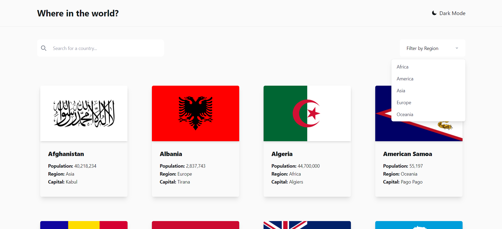

# Frontend Mentor - REST Countries API with color theme switcher solution

This is a solution to the [REST Countries API with color theme switcher challenge on Frontend Mentor](https://www.frontendmentor.io/challenges/rest-countries-api-with-color-theme-switcher-5cacc469fec04111f7b848ca). Frontend Mentor challenges help you improve your coding skills by building realistic projects.

## Table of contents

- [Overview](#overview)
  - [The challenge](#the-challenge)
  - [Screenshot](#screenshot)
  - [Links](#links)
- [My process](#my-process)
  - [Built with](#built-with)
  - [What I learned](#what-i-learned)
- [Author](#author)

## Overview

### The challenge

Users should be able to:

- See all countries from the API on the homepage
- Search for a country using an `input` field
- Filter countries by region
- Click on a country to see more detailed information on a separate page
- Click through to the border countries on the detail page
- Toggle the color scheme between light and dark mode _(optional)_

### Screenshot

### Links

- Solution URL: [https://github.com/KarimAyman97/blog-view-card]
- Live Site URL: [https://blog-view-card.vercel.app/]

## My process

### Built with

- [React](https://reactjs.org/) - JS library
- [Next.js](https://nextjs.org/) - React framework
- [tailwindcss](https://tailwindcss.com/) - A utility-first CSS framework

### What I learned

I learnthow to use external apis with nextjs and using dynamic routes also i learnt how to make dark and light theme in react

## Author

- _Github_ - [@karim_Ayman](https://github.com/KarimAyman97)
- _Frontend Mentor_ - [@Karim_Ayman](https://www.frontendmentor.io/profile/KarimAyman97)
- _LinkedIn_ - [@karimAyman](https://www.linkedin.com/in/karimayman97/)
